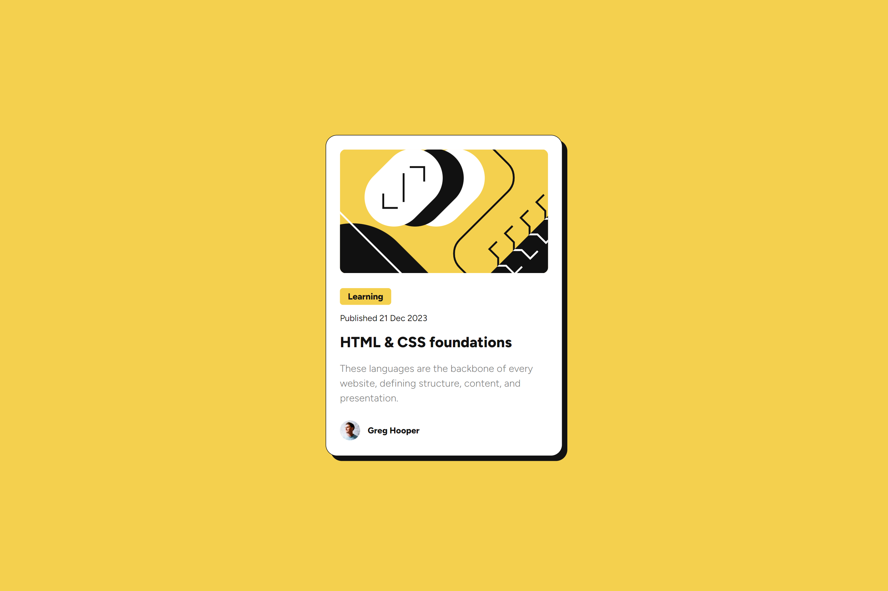

# Frontend Mentor - Blog preview card solution

This is a solution to the [Blog preview card challenge on Frontend Mentor](https://www.frontendmentor.io/challenges/blog-preview-card-ckPaj01IcS). Frontend Mentor challenges help you improve your coding skills by building realistic projects.

## Table of contents

- [The challenge](#the-challenge)
- [Screenshot](#screenshot)
- [Links](#links)
- [My process](#my-process)
- [Built with](#built-with)
- [Author](#author)

### The challenge

Users should be able to:

- See hover and focus states for all interactive elements on the page

### Screenshot

This is the desktop version of the component. I didn't upload the mobile version cause it's too long.

### Links

- Live Site URL: [Live site of the challenge hosted here](https://junayedrahaman50.github.io/blog-preview-card/)

## My process

I have built the layout using flexbox. There are 2 flex containers, body and card where body takes the full width of the viewport and card has fixed width and height based on the desktop design. I have added media queries to make the component responsive. Additionally, I have added external javascript file change the box-shadow property on card element.

### Built with

- Semantic HTML5 markup
- CSS custom properties
- Flexbox
- Javascript

## Author

- Website - [Junayed Rahaman](https://webpixels.netlify.app/)
- Frontend Mentor - [@junayedrahaman50](https://www.frontendmentor.io/profile/junayedrahaman50)
- Twitter - [@junayed_rahaman](https://twitter.com/junayed_rahaman)
